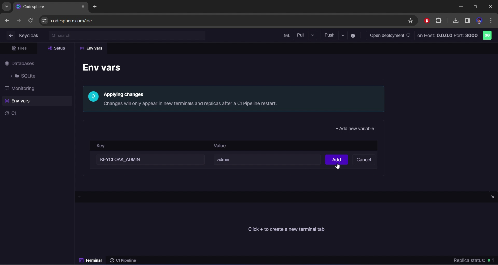
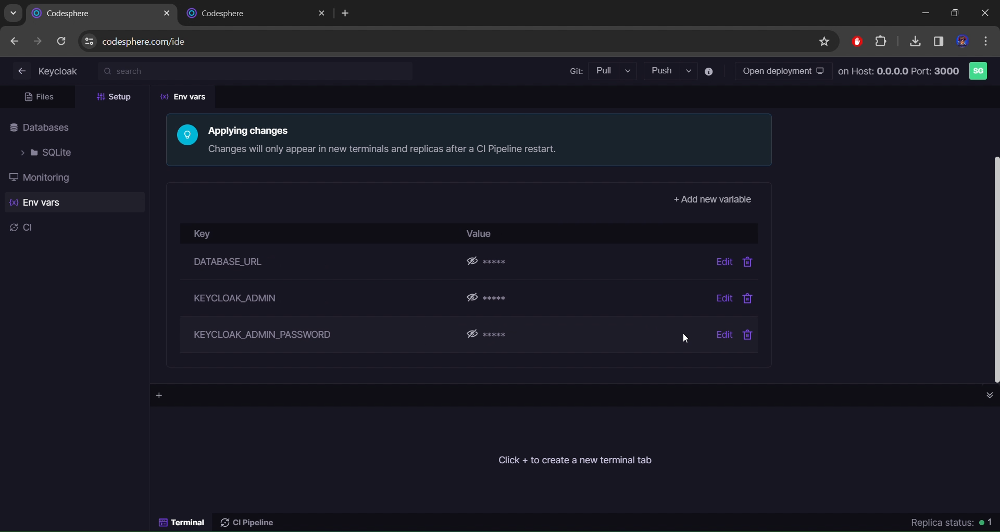

# Keycloak - configuring for production on Codesphere

## What Is Keycloak?
Keycloak is an open-source identity and access management solution that provides robust authentication and authorization services for web and mobile applications. Developed by Red Hat, Keycloak simplifies the implementation of security features by offering a centralized and customizable authentication server. It supports various authentication protocols, including OpenID Connect, OAuth 2.0, and SAML, allowing developers to integrate single sign-on (SSO) capabilities seamlessly. Keycloak's versatile features include user federation, role-based access control, and social identity provider integration, enabling organizations to secure their applications with ease. Its user-friendly administration console facilitates the management of users, groups, and client applications, making it a popular choice for enterprises seeking a comprehensive identity management solution.

## Prerequisites
For following along this tutorial like blog post you need to have these things before diving in with us.

- Codesphere Account
- PostgreSQL Database (can be purchased from Codesphere)

## Getting a database from Codesphere.
- Go to https://codesphere.com/ide/menu/services
.jpg>)
- In the databases section, click on the "Create" button.
.jpg>)
- Select PostgreSQL from the dropdown of the available databases.
.jpg>)
- Click on the "Create" button once you have choosen your prefered configuration.
.jpg>)
- Wait for the "Actions" tab to show the text, "Show info". This may take a while.
- Click on the "Show info" button and copy the "Connetion String". This is the database URL you will need in the further steps.
.jpg>)

## Installing Keycloak On Codesphere.
- Navigate to Codesphere's workspaces page.
.jpg>)
- Click on the "New Workspace" button.
.jpg>)
- Create a new workspace with the Github url: https://github.com/codesphere-community/Keycloak
.jpg>)
- Click on the "Create" button after choosing your preferred settings.
.jpg>)
- Head over to the "Setup" section of the IDE.

- Click on "Env vars" in the list.
.jpg>)
- Click on "Add new variable" option to add a variable.

- Add the variables:
   - DATABASE_URL (The database URL).
   - KEYCLOAK_ADMIN (The admin username).
   - KEYCLOAK_ADMIN_PASSWORD (The admin password).
   
- Click on the "CI Pipeline" button on the bottom of the page.
.jpg>)
- Click on the "Run" button to run the installation script. Go to the next step only after the "Prepare" button on the left panel turn Green in colour.
.jpg>)
- Click on the "Run" button on the left panel.
.jpg>)
- Click on the smaller "Run" button on the right panel.
.jpg>)
- If this is the first time installation, wait for about 30 seconds before continuing to the next step. After the first time, it would start in under 15 seconds.
- Click on the "Open Deployment" button on the top panel of the page.
.jpg>)
- After Keycloak opens, click on "Administration Console" button.
.jpg>)
- Log in with your environment variables KEYCLOAK_ADMIN (username) and KEYCLOAK_ADMIN_PASSWORD (password)
.jpg>)
Congratulations, You have successfully set up Keycloak on Codesphere 🎉
